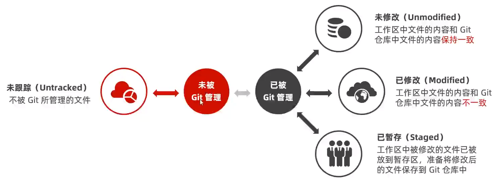
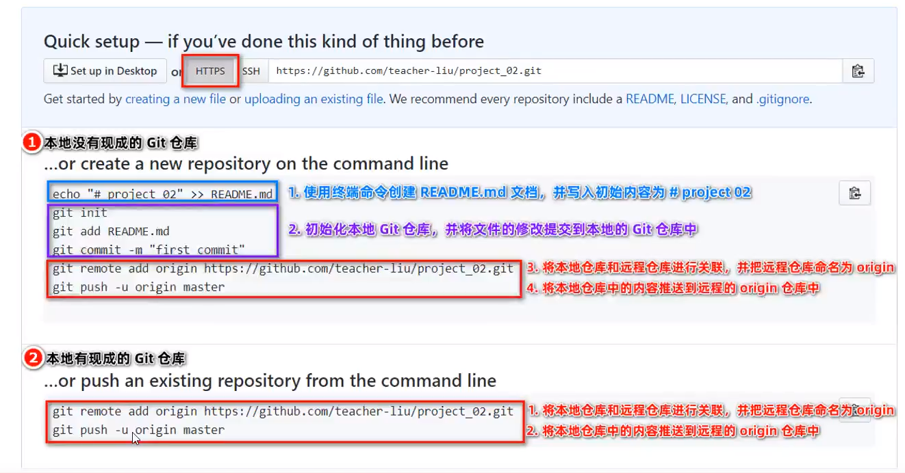

## Git

- 版本控制的概念

  - 概念：版本控制软件是一个用来**记录文件变化**，以便将来查阅特定版本修订情况的系统，因此有时也叫做**“版本控制系统”**
  - 通俗的理解：把**手工管理**版本的方式，改为由**软件管理**文件的版本；这个**负责管理文件版本的软件**，叫做”版本控制软件“
  - 使用版本控制软件的好处：
    - 操作简便
    - 易于对比
    - 易于回溯
    - 不易丢失
    - 协作方便

- ```git
  git init
  git config --list --global	//显示信息
  git help config				//打开帮助手册
  git config -h				//简明的帮助手册
  ```
  
  
  
- Git基础概念

  - Git是一个**开源的分布式版本控制系统**，是目前世界上**最先进、最流行**的版本控制系统。可以快速高效地处理从很小到非常大的项目版本管理

  - 特点：项目越大越复杂，协同开发者越多，越能体现出Git的高性能和高可用性

  - Git的特性：

    Git之所以快速和高效，主要依赖于它的两个特性：

    - 直接记录快照，而非差异比较
    - 近乎所有操作都是本地执行

  - SVN的差异比较

    - 传统的版本控制系统（如SVN）是**基于差异**的版本控制，它们存储的是**一组基本文件**和**每个文件随时间逐步积累的差异**
    - 好处：节省磁盘空间
    - 缺点：耗时、效率低

  - Git的记录快照

    - **Git快照**是在原有文件版本的基础上重新生成一份新的文件，**类似于备份**。为了效率，如果文件没有修改，Git不再重新存储该文件，而是只保留一个链接指向之前存储的文件
    - 缺点：占用磁盘空间较大
    - 优点：**版本切换时非常快，**因为每个版本都是完整的文件快照，切换版本时直接回复目标版本的快照即可。
    - 特点：**空间换时间**

  - Git中的三个区域

    - 使用Git管理的项目，拥有三个区域，分别是**工作区、暂存区、Git仓库**

  - Git中的三种状态

    - 已修改（modified）：表示修改了文件，但还没将修改的结果放到暂存区
    - 已暂存（staged）：表示对已修改文件的当前版本做了标记，使之包含在下次提交的列表中
    - 已提交（committed）：表示文件已经安全地保存在本地的Git仓库中
    - 注意：
      - 工作区的文件被修改了，但还没有放到暂存区，就是**已修改**状态
      - 如果文件已修改并放入暂存区，就属于**已暂存**状态
      - 如果Git仓库中**保存着特定版本**的文件，就属于**已提交**状态

  - 基本的Git工作流程

    - 在工作区中修改文件
    - 将你想要下次提交的更改进行暂存
    - 提交更新，找到暂存区的文件，将快照永久性存储到Git仓库

  

- Git的基本操作

  - 获取Git仓库的两种方式

    - **将**尚未进行版本控制的**本地目录<u>转化</u>为Git仓库**
    - 从其他服务器**克隆**一个已存在的Git仓库

  - 在现有目录中初始化仓库

    - 如果自己有一个尚未进行版本控制的项目目录，想要用Git来控制他，需要执行如下两个步骤：
      - 在项目目录中，通过鼠标右键打开”Git Bash“
      - 执行**<u>git init</u>**命令将当前的目录转化为Git仓库

    - git init 命令会创建一个名为.git的隐藏目录**，这个.git目录就是当前项目的Git仓库**，里面包含了**初始的必要文件**，这些文件是Git仓库的**必要组成仓库**

  - 工作区中的四种状态

    - 工作区中的每一个文件可能有四种状态，这四种状态共分为两大类，如图所示：

      

  - 检查文件的状态

    - 可以使用**git status**命令查看文件处于什么状态
    - 在状态报告中可以看到新建的**index.html**文件出现在**Untracked files**（未跟踪的文件）下面
    - 未跟踪的文件意味着**Git在之前的快照（提交）中没有这些文件**；Git不会自动将之纳入跟踪范围，除非明确地告诉它”我需要使用Git跟踪管理文件“

  - 以精简的方式显示文件状态

    - 使用**git status**输出的状态报告很详细，但有些繁琐。如果希望**以精简的方式显示文件的状态**，可以使用如下两条完全等价的命令，其中**-s是 --short的简写模式**

    - ```git
      git status -s
      git status --short
      ```

    - **未跟踪文件**前面有**红色的??**标记

  - 跟踪新文件

    - 使用命令**git add**开始跟踪一个文件。所以，要跟踪index.html文件，允许如下的命令即可：

    - ```git
      git add index.html
      ```

    - 此时再允许git status命令，会看到index.html文件在**Changes to committed**这行的下面，说明**已被跟踪**，并**处于暂存状态**

    - 以精简的方式显示文件的状态：**新添加到暂存区**中的文件前面有**绿色的A**标记

  - 提交更新

    - 提交成功之后，再次检查文件的状态，得到：nothing to commit, working tree clean
    - 证明工作区中所有的文件都处于**”未修改**“的状态，**没有任何文件需要被提交**

  - 对已提交的文件进行修改

    - 目前，index.html文件**已被Git跟踪**，并且**工作区和Git仓库**中的index.html文件**内容保持一致**。当我们修改了工作区中 index.html的内容之后，再次运行**git status**和**git status -s**命令 ，则文件index.html会出现在**Changes not staged for commit** 这行下面，说明**已跟踪文件的内容发生了变化，但还没有放到暂存区**
    - 注意：**修改过的、没有放入暂存区的文件**前面有**红色的M**标记

  - 暂存已修改的文件

    - 目前，工作区中的index.html文件已被修改，如果要暂存这次修改，需要再次运行**git add**命令。这个命令是个多功能的命令，主要有如下三个功效：

      - 可以用它**开始跟踪新文件**
      - 把**已跟踪的、且已修改**的文件放到暂存区
      - 把有冲突的文件标记为已解决的状态

    - **绿色的M**表示文件**已修改且已放入暂存区**

    - ```git
      git add index.html
      ```

  - 提交已暂存的文件

    - 再次运行**git commit -m ”提交消息“**命令，即可将暂存区中记录的index.html的快照，提交到Git仓库中进行保存：

  - 撤销对文件的修改

    - 撤销对文件的修改指的是：把对工作区中对应文件的修改，**还原**成Git仓库中所保存的版本。

    - 操作的结果：所有的修改会丢失，且无法恢复！**危险性比较高，请谨慎操作！**

    - ```git
      git checkout -- index.html
      ```

    - **撤销操作的本质**：用Git仓库中保存的文件，覆盖工作区中指定的文件

  - 向暂存区中一次性添加多个文件

    - 如果需要被暂存的文件个数较多，可以使用如下的命令，一次性将所有的新增和修改过的文件加入暂存区：

      ```git
      git add .
      ```

    - **今后在项目开发中，会经常使用这个命令，将新增和修改过后的文件加入暂存区**

  - 取消暂存的文件

    - 如果需要从暂存区中移除对应的文件，可以使用如下的命令：

      ```git
      git reset HEAD 要移除的文件名称
      git reset HEAD .                                    //可以移除所有文件
      ```

  - 跳过使用暂存区域

    - Git标准的工作流程是**工作区->暂存区->Git仓库**，但有时候这么做略显繁琐，此时可以跳过暂存区，直接将工作区中的修改提交到Git仓库，这时候Git工作的流程简化为了**工作区->Git仓库**

    - Git提供了一个跳过使用暂存区域的方式，只要在提交的时候，给**git commit加上-a选项**，Git就会自动把所有已经跟踪过的文件暂存起来一起提交，从而跳过git add 步骤

    - ```git
      git commit -a -m "描述信息"
      ```

  - 移除文件

    从Git仓库中移除文件的方式有两种：

    - 从Git仓库和工作区中**同时移除**对应的文件

    - 只从Git仓库中移除指定的文件，但保留工作区中对应的文件

    - ```git
      # 从Git仓库和工作区中同时移除对应的文件
      git rm -f index.js
      # 只从Git仓库中移除指定的文件，但保留工作区中对应的文件
      git rm --cached index.js
      ```

  - 忽略文件

    - 一般我们总会有些文件无需纳入Git的管理，也不希望它们总出现在未跟踪文件列表。在这种情况下，我们可以创建一个名为**.gitignore**的配置文件，列出要忽略的文件的匹配模式
    - 文件.gitignore的格式规范如下：
      - 以**#开头**的是注释
      - 以**/结尾**的是目录
      - 以**/开头**防止递归
      - 以**！开头**表示取反
      - 可以使用**glob模式**进行文件和文件夹的匹配（glob指简化了的正则表达式）

  - glob模式

    所谓的glob模式是指简化了的正则表达式：

    - **星号***匹配**零个或多个任意字符**
    - **[abc]**匹配**任何一个列在方括号中的字符**（此案例匹配一个a或匹配一个b或匹配一个c）
    - **问号？**只匹配**一个任意字符**
    - 在方括号中使用**短划线**分隔两个字符，表示所有在这两个字符范围内的都可以匹配（比如[0-9]表示匹配所有0到9的数字）
    - **两个星号**** 表示 **匹配任意中间目录**（比如a/**/z可以匹配a/z、a/b/z或a/b/c/z等）

  - .gitignore文件的例子

    - ```git
      # 忽略所有的.a文件
      #.a
      
      # 但跟踪所有的 lib.a ，即使你在前面忽略了.a文件
      ！lib.a
      
      # 只忽略当前目录下的TODO文件，而不忽略subdir/TODO
      /TODO
      
      # 忽略任何目录下名为build的文件夹
      build/
      
      # 忽略doc/notes.txt，但不忽略 doc/server/arch.txt
      doc/*.txt
      
      # 忽略doc/目录及其所有子目录下的.pdf文件
      doc/**/*.pdf
      ```

  - 查看提交历史

    - 如果希望回顾项目的提交历史，可以使用git log这个简单且有效的命令

    - ```git
      # 按时间先后顺序列出所有的提交历史，最近的提交排在最上面
      git log
      
      # 只展示最新的两条提交历史，数字可以按需进行填写
      git log -2
      
      # 在一行上展示最近两条提交历史的信息
      git log -2 --pretty=oneline
      
      # 在一行上展示最近两条提交历史的信息，并自定义输出的格式
      # %h提交的简写哈希值， %an作者名字    %ar作者修订日期，按多久以前的方式显示        %s提交说明
      git log -2 --pretty=format:"%h | %an | %ar | %s"
      ```

  -  回退到指定的版本

    - ```git
      # 在一行上展示所有的提交历史
      git log --pretty=oneline
      
      # 使用git reset --hard命令，根据指定的提交ID 回退到指定版本
      git reset --hand<CommitID>
      
      # 在旧版本中使用git reflog --pretty=oneline命令，查看命令操作的历史
      git reflog --pretty=oneline
      
      # 再次根据最新的提交ID，跳转到最新的版本
      git reset --hard<CommitID>
      ```

  - 小结

    - 初始化Git仓库的命令：**git init**
    - 查看文件状态的命令：**git status 或 git status -s**
    - 一次性将文件加入暂存区的命令：**git add .** 
    - 将暂存区的文件提交到Git仓库的命令：**git commit -m”提交消息“**


- 了解开源相关的概念

  - 什么是开源

    - 概念：**开源**即**开放源代码**
    - 基本含义：代码是公开的
    - 特点：任何人都可以去**查看，修改和使用**开源代码

  - 什么是**开源许可协议**

    - 开源并不意味着完全没有限制，为了**限制使用者的适用范围和保护作者的权利**，每个开源项目都应该遵守**开源许可协议**

  - 常见的5中开源许可协议

    - BSD（Berkeley Software Distribution)
    - Apache Licence 2.0
    - **GPL**(GNU General Public License)
      - 具有传染性的一种开源协议，不允许修改后和衍生的代码作为闭源的商业软件发布和销售
      - 使用GPL的最著名的软件项目是：Linux
    - LGPL(GNU Lesser General Public License)
    - **MIT**(Massachusetts Institute of Technology,MIT)
      - 是目前限制最少的协议，唯一的条件：在修改后的代码或者发行包中，必须包换原作者的许可信息
      - 使用MIT的软件项目有：jQuery、Node.js

  - 为什么要**拥抱开源**

    开源的**核心思想**是”**我为人人，人人为我**“，人们越来越喜欢开源大致是出于以下3个原因：

    - 开源给使用者更多的控制权
    - 开源让学习变得容易
    - 开源才有真正的安全
    - 开源是软件开发领域的大趋势，**拥抱开源就像站在了巨人的肩膀上**，不用自己重复造轮子，让开发越来越容易

  - 开源项目托管平台

    - 专门用于**免费存放开源项目源代码的网站**，叫做**开源项目托管平台**。目前世界上**比较出名的**开源项目托管平台主要有以下3个：
      - Github（全球最大的开源项目托管平台，没有之一）
      - Gitlab（对代码私有性支持较好，因此企业用户较多）
      - Gitee（又叫做**码云**，是国产的开源项目托管平台。访问速度快、纯中文界面、使用友好）
    - 注意：以上3个开源项目托管平台，只能托管以Git管理的项目源代码，因此，它们的名字都以Git开头

  - 什么是Github

    - Github是全球最大的开源项目托管平台。因为只支持Git为唯一的版本控制工具，故名Github
    - 在Github中，你可以：
      - 关注自己喜欢的开源项目，为其点赞打call
      - 为自己喜欢的开源项目做贡献（Pull Request）
      - 和开源项目的作者讨论Bug和提需求（Issues）
      - 把喜欢的项目复制一份作为自己的项目进行修改（Fork）
      - 创建属于自己的开源项目


- Github

  - 远程仓库的使用
    - Github上的远程仓库，有两种访问方式，分别是**HTTPS和SSH**，它们的区别是：
      - HTTPS：零配置；但是每次访问仓库时，需要重复输入Github的账号和密码才能访问成功
      - SSH：需要进行额外的配置；但是配置成功之后，每次访问仓库时，不需重复输入Github账号和密码
    - 注意：在实际开发中**，推荐使用SSH的方式访问远程仓库**
  - 基于HTTPS将本地仓库上传到Github
    - 
    - 只有第一次推送代码才需要用到git push -u origin master
    - 之后只要git push
  
  
  
  - SSH key
  
    - SSH key的**作用**：实现本地仓库和Github之间**免登录的加密数据传输**
    - SSH key的**好处**：免登录身份认证、数据加密传输
    - SSH key由两部分组成，分别是：
      - id_rsa（私钥文件，存放于客户端的电脑中即可）
      - id_rsa.pub（公钥文件，需要配置到Github中）
  
  - 生成SSH key
  
    - 打开Git Bash
  
    - 粘贴如下命令，并将your_email@example.com替换为注册Github账号时填写的邮箱：
  
      ssh-keygen -t rsa -b 4096 -C "your_email@example.com"
  
    - 连续敲击3次回车，即可在C:\Users\用户名文件夹\.ssh目录中生成id_rsa和id_rsa.pub两个文件
  
  - 配置SSH key
  
    - 使用记事本打开**id_rsa.pub**文件，复制里面的文本内容
    - 在浏览器中登录Github，**点击头像->Settings->SSH and GPG keys->New SSH key**
    - 将id_rsa.pub文件中的内容，粘贴到Key对应的文本框中
    - 在Title文本框中任意填写一个名称，来标识这个Key从何而来
  
  - 检测Github的SSH key是否配置成功
  
    - 打开Git Bash，输入如下的命令并回车执行：
  
      ```git
      ssh -T git@github.com
      ```
  
    - 若显示 Hi XXX! You've successfully authenticated, but Gitee.com does not provide shell access. 就说明你添加成功啦~
  
  - 基于SSH将本地仓库上传到Github
  
    - 
  
  - 将远程仓库克隆到本地
  
    - 打开Git Bash，输入如下的命令并回车执行：
  
      ```git
      git clone 远程仓库的地址
      ```
  
    - 远程仓库的地址在仓库页面右上角（克隆处）


- Git分支
  - 分支的概念
    - 分支就是科幻电影里面的**平行宇宙**，当你正在电脑前努力学习Git的时候，另一个你在另一个平行宇宙里努力学习SVN
    
  - 分支在实际开发中的作用

    - 在进行多人协作开发的时候，为了防止互相干扰，提高协同开发的体验，建议每个开发者都基于分支进行项目功能的开发，比如：

  - master主分支

    - 在初始化本地Git仓库的时候，Git默认已经帮我们创建了一个名字叫做**master**的分支。通常我们把这个master分支叫做**主分支**
    - 在实际工作中，master主分支的作用是：**用来保存和记录整个项目已完成的功能代码**
    - 因此，不允许程序员直接在master分支上修改代码，因为这样做的风险太高，容易导致整个项目崩溃

  - 功能分支

    - 由于程序员不能直接在master分支上进行功能的开发，所以就有了功能分支的概念
    - **功能分支**指的是**专门用来开发新功能的分支**，它是临时从master主分支上分叉出来的，当新功能开发且测试完毕后，最终需要合并到master主分支上

  - 查看分支列表

    - 使用如下命令，可以查看当前Git仓库中所有的分支列表：

      ```git
      git branch
      ```

    - 注意：分支名字前面的*****号表示**当前所处的分支**

  - 创建新分支

    - 使用如下的命令，可以**基于当前分支，创建一个新的分支**，此时，新分支中的代码和当前分支完全一样：

      ```git
      git branch 分支名称
      ```

    - 注意：**执行完创建分支的命令之后，用户当前所处的还是master分支（原分支）**

  - 切换分支

    - 使用如下的命令，可以**切换到指定的分支上**进行开发：

      ```git
      git checkout login
      ```

  - 分支的快速创建和切换

    - 使用如下的命令，可以**创建指定名称的新分支**，并**立即切换到新分支**上：

      ```git
      # -b表示创建一个新分支
      # checkout表示切换到刚才新建的分支上
      
      git checkout -b 分支名称
      ```

  - 合并分支

    - 功能分支的代码开发测试完毕后，可以使用如下的命令，将完成后的代码合并到master主分支上：

      ```git
      # 1.切换到master分支
      git checkout master
      
      # 2.在master分支上运行git merge 命令，将login分支的代码合并到master分支
      git merge login
      ```

    - 合并分支时的注意点：假设要把C分支的代码合并到A分支，则**必须先切换到A分支上，再运行git merge 命令**来合并C分支

  - 删除分支

    - 当把功能分支的代码合并到master主分支上以后，就可以使用如下的命令，删除对应的功能分支：

      ```git
      git branch -d 分支名称
      ```

  - 遇到冲突时的分支合并

    - 如果**在两个不同的分支中**，对**同一个文件**进行了**不同的修改**，Git就没法干净的合并它们。此时，我们需要打开这些包含冲突 的文件然后**手动解决冲突**

    - ```git
      # 假设：在把reg分支合并到master分支期间，代码发生了冲突
      git checkout master
      git merge reg
      
      # 打开包含冲突的文件，手动解决冲突之后，再执行如下的命令：
      git add . 
      git commit -m "解决了分支合并冲突的问题"
      ```

    

  - **远程分支操作**

    - 如果是**第一次**将本地分支推送到远程仓库，需要运行如下的命令：

      ```git
      # -u 表示把本地分支和远程分支进行关联，只在第一次推送的时候需要待 -u参数
      git push -u 远程仓库的别名 本地分支名称：远程分支名称
      
      # 实际案例：
      git push -u origin payment:pay
      
      # 如果希望远程分支的名称和本地分支的名称保持一致，可以对命令进行简化：
      git push -u origin payment
      ```

    - 注意：第一次推送分支需要带 **-u参数**，此后可以直接使用 **git push**推送代码到远程分支

  - 查看远程仓库中所有的分支列表

    - 通过如下的命令，可以查看远程仓库中所有的分支列表的信息：

      ```git
      git remote show 远程仓库名称
      ```

  - 跟踪分支

    - 跟踪分支指的是：从远程仓库中，把远程分支下载到本地仓库中。需要运行的命令如下：

    - ```git
      # 从远程仓库中，把对应的远程分支下载到本地仓库，保持本地分支和远程分支名称相同
      git checkout 远程分支的名称
      # 示例：
      git checkout pay
      
      # 从远程仓库中，把对应的远程分支下载到本地仓库，并把下载的本地分支进行重命名
      git checkout -b 本地分支名称 远程仓库名称/远程分支名称
      # 示例：
      git checkout -b payment origin/pay
      ```

  - 拉去远程分支的最新的代码

    - 可以使用如下的命令，把远程分支最新的代码下载到本地对应的分支中：

      ```git
      # 从远程仓库，拉去当前分支最新的代码，保持当前分支的代码和远程分支代码一致
      git pull 
      ```

  - 删除远程分支

    - 可以使用如下的命令，删除远程仓库中指定的分支：

      ```git
      # 删除远程仓库中，指定名称的远程分支
      git push 远程仓库名称 --delete 远程分支名称
      # 示例：
      git push origin --delete pay
      ```

    

  - 总结：

    - 能够掌握Git中基本命令的使用
      - git init
      - git add .
      - git commit -m "提交消息"
      - git status 和 git status -s
    - 能够使用Github创建和维护远程仓库
      - 能够配置Github的SSH访问
      - 能够将本地仓库上传到Github
    - 能够掌握Git分支的基本使用
      -  git checkout -b 新分支名称
      - git push -u origin 新分支名称
      - git checkout 分支名称
      - git branch